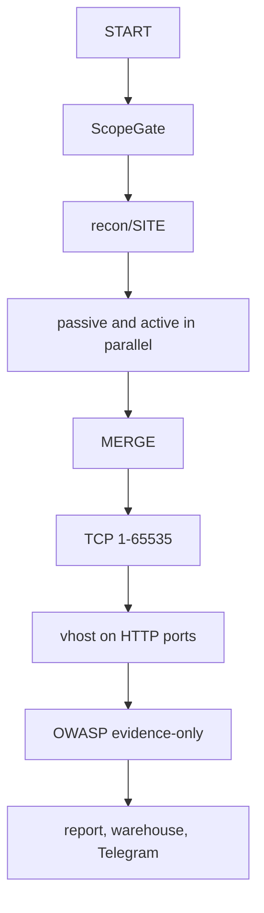

<p align="center">
  
</p>

<h1 align="center">moirax-ASM</h1>

<p align="center">
  Attack surface management for domains you are authorized to test.
</p>

Give it a domain. It finds names that belong to that estate, resolves them,
sweeps ports, compares the result to the last run, and can page you on
Telegram. Then it writes a report you can open or share.

It is not a vulnerability scanner. It does not send exploit payloads. The
OWASP pass only reads evidence the run already collected. Every name is
checked against `scope.yaml` first; suffix tricks that only look in-scope
are refused.

Run it only against assets you own or have written permission to test.

---

## Features

- **Passive discovery** from certificate logs, public datasets, and optional
  search APIs. A missing key skips that source and says so in the log.
- **Active discovery** with dnsx. Catch-all DNS (`*.example.com`) is probed
  so random labels are not treated as real hosts. Host-header virtual hosts
  are a separate step, not the DNS brute.
- **Full TCP sweep** (1-65535) on unique IPs after merge.
- **Results** as one row per name. The table shows an open-port count. Click
  it for that name's IPs; click an IP for port, product, and version. Empty
  product or version means the fingerprint did not identify them.
- **Diffs and alerts** for added, removed, and changed hosts and ports.
  Telegram is optional and follows the rules you tick.
- **Reports** in HTML, PDF, CSV, JSON, and Markdown, with a SHA-256 manifest
  so you can tell if the bundle was edited after generate.

Each site lives under `recon/<site>/`. Operator login is stored in
`dashboard/auth/`, not in the warehouse database.

---

## Install

Needs Git, Docker, roughly 4 GB RAM and 10 GB disk. Host Python 3 is only
for `./recon.sh`. No external database. Default branch is `private`.

```bash
git clone --depth 1 https://github.com/Erfanmghs/moirax-asm.git
cd moirax-asm
cp .env.example .env
docker compose --profile dashboard up -d --build
```

Open http://127.0.0.1:8080 and set an operator password (12+ characters).
The hash is written under `dashboard/auth/`. Do not put the password in
`.env`.

**Docker security is part of the default install**, not an extra profile.
The UI binds to loopback. Compose drops all Linux capabilities except
the three the entrypoint needs to drop from root (`SETUID` / `SETGID` /
`CHOWN`), sets `no-new-privileges`, uses `init` and a `tmpfs` `/tmp`,
and rotates container logs. Dashboard Python packages are pinned in
`requirements.txt` and scanned with `pip-audit` before the image is
published. Nested scans still need `docker.sock` on this host, so treat
the machine as a single-operator workstation. Details:
[docs/security.md](docs/security.md) section 6.

If 8080 is busy, set `DASHBOARD_BIND_PORT=9090` in `.env` and recreate
the container. On Linux, set `RECON_HOST_UID` and `RECON_HOST_GID` to
`id -u` / `id -g` so nested Docker and file ownership line up.

Optional wordlists: clone [SecLists](https://github.com/danielmiessler/SecLists)
to `~/seclists`. Compose mounts it read-only. If that directory is missing,
Docker creates an empty one and the lists in this repo still work.

Or pull the published image (`docker login ghcr.io` with `read:packages`):

```bash
docker pull ghcr.io/erfanmghs/moirax-asm:dashboard
docker tag ghcr.io/erfanmghs/moirax-asm:dashboard moirax-asm-dashboard
docker compose --profile dashboard up -d
```

```bash
docker compose --profile dashboard up -d          # start
docker compose --profile dashboard down           # stop
git pull && docker compose --profile dashboard up -d --build   # update
docker compose logs -f dashboard                  # logs
```

---

## First run

1. **SETTINGS** -- Telegram handle or numeric id, SAVE, SEND TEST. For a
   personal bot, open it, press Start, then retry.
2. **SCAN** -- type a domain you may test. Tick Authorize if it is not on
   the allow-list yet. ADD TARGET, then START. SETUP on the row is optional;
   empty fields inherit global settings.
3. Watch the live log. Small estates finish in minutes; large wordlists can
   take around an hour.
4. **RESULTS** -- pick the site. The table updates from live DNS while a
   scan is running. Click a live host to open it. Click the port count, then
   an IP, for the service table.
5. **REPORTS** -- GENERATE NOW, then open `report.html` or the PDF.

The committed `scope.yaml` is a fixture (`example.com` and the local e2e
zone). ADD TARGET appends your apex on disk. Leave those edits, `.env`,
`targets.yaml`, `dashboard/config.json`, and `recon/` uncommitted.

DELETE on SCAN hides the site from the board and keeps warehouse history
for the retention window.

---

## Pipeline



Passive is OSINT. Active is dnsx brute and resolve, then virtual-host
fuzzing. Merge writes the host index. The port sweep runs after merge so it
only sees names that survived scope and wildcard filtering. Each module has
its own image. STOP kills the run and related containers.

Depths are independent (SETTINGS or per-site SETUP):

- **DNS depth** -- labels under the apex that dnsx will brute
- **vhost depth** -- how far Host-header enumeration walks
- **Passive recursion** -- how far OSINT follows related names

Optional API keys only add sources. The keyless path always runs.

---

## CLI

Host Python 3. The scope check runs before any container starts.

```bash
./recon.sh run example.com
./recon.sh stop example.com
./recon.sh resume example.com
./recon.sh status example.com
./recon.sh report example.com
./recon.sh fleet run --targets all --concurrency 3
```

No arguments prints the rest. Fleet runs sites in parallel; one failure
does not stop the others.

Scheduler is in SETTINGS / SETUP (minutes, minimum 10). Idle sessions
expire after 15 minutes. LOCK signs you out. Scripts can still send
`Authorization: Bearer` with `DASHBOARD_TOKEN`.

---

## Telegram, keys, proxies

Put your Telegram username or id in SETTINGS (or per site). The bot token
stays in `.env`. Mute one site with `telegram_enabled: false` on its
profile. Comma-separated `TELEGRAM_BOT_TOKEN` values are backups; a 401
rotates to the next token. Tokens are never printed.

Paste optional keys on **API KEYS**. The next run picks them up with no
restart. See [docs/api-keys.md](docs/api-keys.md).

PROXY POOL is comma-separated HTTP or SOCKS5 URLs, health-checked before a
run. Port-sweep and the dedicated DNS resolver stay direct.

| Variable | Role |
|---|---|
| `TELEGRAM_BOT_TOKEN` | Bot token; comma-separated backups |
| `TELEGRAM_CHAT_ID` | Fallback if SETTINGS is empty |
| `DASHBOARD_TOKEN` | CI / legacy bearer; operators use the password gate |
| `PROXY_POOL` | Global proxies if SETTINGS is empty |
| `RECON_HOST_UID` / `GID` | Linux ownership and nested Docker |

---

## Repository layout

```
recon.sh         CLI (python -m pipeline.cli)
pipeline/        engine, modules, reporting, fleet
dashboard/       FastAPI app and static console
tests/           unit tests
ci/              release and acceptance gates
docs/HELP.md     operator walkthrough (also the HELP tab)
```

Per-site output is gitignored, under `recon/<site>/`:

```
00_assets/assets.json    merged host index
20_dns/dnsx/             brute, resolve, wildcard probe
30_ports/                full TCP sweep
90_report/               html / pdf / csv / json / md + manifest
diff.json                versus previous run
logs/run.log             SCAN live log
```

---

## Troubleshooting

| Symptom | Fix |
|---|---|
| `docker: command not found` | Install and start Docker |
| `permission denied ... docker.sock` in the live log | `docker compose --profile dashboard up -d --build --force-recreate`. On Linux, add your user to the `docker` group and log out/in. |
| Clone rejects a password | `gh auth login` or a PAT with `repo` |
| `pull access denied` on GHCR | `docker login ghcr.io`, or build locally |
| Port already allocated | `DASHBOARD_BIND_PORT` in `.env` |
| First start looks stuck | Image layers -- `docker compose logs -f dashboard` |
| START says add the target first | ADD TARGET on SCAN, then START |
| START 422 | Lowercase DNS name, no flags or paths |

---

## Docs

- [Operator guide](docs/HELP.md) -- every dashboard control
- [API keys](docs/api-keys.md) -- optional providers
- [Security](docs/security.md) -- bind, auth, Docker hardening, leak response
- [Handover](docs/HANDOVER.md) -- engineering map

---

## Legal

Unauthorized scanning of systems you do not own, or do not have permission
to test, is illegal. Do not disable the allow-list.
