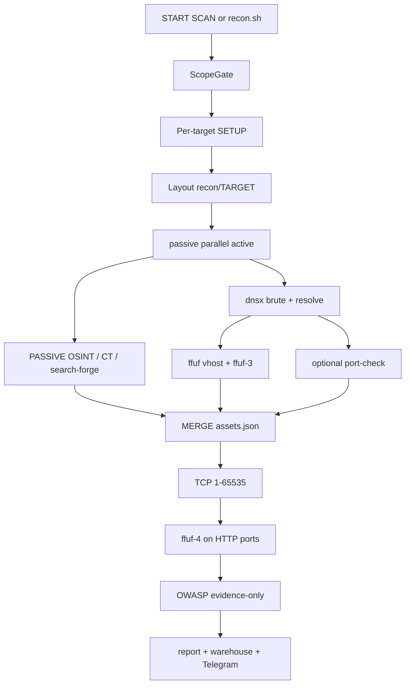

<p align="center">
  
</p>

<h1 align="center">Attack Surface Management</h1>

<p align="center">
  <b>moirax-ASM</b> -- outside-in inventory of a DNS estate you are authorized to test.<br>
  Enumerate, resolve, probe, sweep, diff, alert, report. Operators drive a loopback dashboard.<br>
  The same ladder is <code>./recon.sh</code>.
</p>

<p align="center">
  <a href="#install"></a>
  <a href="#first-scan"></a>
  <a href="#how-a-run-works"></a>
  <a href="docs/HELP.md"></a>
</p>

<p align="center">
  It does <b>not</b> exploit. It does <b>not</b> send exploit payloads.<br>
  OWASP pass is evidence-only (zero extra packets). ScopeGate is a hard stop, not a warning.
</p>


| You | Start |
|---|---|
| Install and first scan | [Install](#install) then [First scan](#first-scan) |
| Architecture / laws | [How a run works](#how-a-run-works) |
| CLI / fleet | [Command line](#command-line) |
| Keys, bind, leak response | [docs/security.md](docs/security.md), [docs/api-keys.md](docs/api-keys.md) |
| Every dashboard control | [docs/HELP.md](docs/HELP.md) |
| Engineer's map | [docs/HANDOVER.md](docs/HANDOVER.md) |

ASCII English only in this tree (release gate R-3). Scan only what you own
or have written permission to test.

---

## Why this is not "nmap plus a spreadsheet"

| Law | What you get |
|---|---|
| One ladder | Passive \|\| active -> merge -> full TCP sweep -> post-port vhost -> passive OWASP. Not a pile of unrelated binaries. |
| Diff | Added / removed / changed hosts and ports vs the last run (HTTP length on reports when httpx is on). |
| Telegram | New host, removed host, changed host, newly opened port. Above the digest threshold: one grouped DIGEST, not a flood. |
| Tamper-checked report | HTML / PDF / CSV / JSON / Markdown + SHA-256 manifest. |
| ScopeGate | Every host is checked against `scope.yaml`. Suffix tricks (`evil-target.com` pretending to be `target.com`) are refused. |
| Never-silent | A skipped source prints WHY. Missing optional keys skip with an explicit line. |
| Per-target profiles | Depths, wordlists, Telegram receiver, proxy pool, budgets -- without mutating committed defaults for longer than the run. |

---

## Install

Need: Git, Docker Engine (or Docker Desktop), ~4 GB RAM, ~10 GB disk,
network. No database. No paid keys. Python 3 on the host is required only
for `./recon.sh`; the dashboard image carries its own runtime.

Shallow clone (this repository's default branch is `private`):

```bash
git clone --depth 1 https://github.com/Erfanmghs/moirax-ASM.git
cd moirax-ASM
cp .env.example .env
```

GitHub will not accept an account password. Use `gh auth login` or a PAT
with `repo` (and `read:packages` if you pull the published image).

Optional installer lines in `.env` (everything else can wait):

```
TELEGRAM_BOT_TOKEN=          # @BotFather /newbot; comma-separated backups ok
RECON_HOST_UID=              # Linux: id -u
RECON_HOST_GID=              # Linux: id -g
DOCKER_GID=                  # Linux: getent group docker | cut -d: -f3
```

Do not put the dashboard password in `.env`. The first browser visit asks
you to choose it (12+ characters, scrypt hash in `dashboard/auth/`, never
inside `recon/`).

Optional SecLists mount (compose bind-mounts `~/seclists` read-only). If
that directory is missing, Docker creates an empty one; curated lists in
the repo still work:

```bash
git clone --depth 1 https://github.com/danielmiessler/SecLists.git ~/seclists
```

**Start the dashboard** (slow on the first build; later starts are seconds).
Compose `restart: unless-stopped` brings it back after reboot.

Build locally (no GHCR login):

```bash
docker compose --profile dashboard up -d --build
```

Or pull the published image if your GitHub account can read packages:

```bash
docker login ghcr.io -u YOUR-GITHUB-USERNAME   # PAT as password
docker pull ghcr.io/erfanmghs/moirax-asm:dashboard
docker tag ghcr.io/erfanmghs/moirax-asm:dashboard moirax-asm-dashboard
docker compose --profile dashboard up -d
```

Check: `docker compose --profile dashboard ps` -- status **Up**.
If 8080 is taken, set `DASHBOARD_BIND_PORT=9090` in `.env` and recreate.
Bind defaults to `127.0.0.1`; the SPA is not meant to be on the public net.

Open **http://127.0.0.1:8080** -- Set operator password -> Register.

| I want to ... | Command |
|---|---|
| Start | `docker compose --profile dashboard up -d` |
| Stop | `docker compose --profile dashboard down` |
| Update | `git pull` then `docker compose --profile dashboard up -d --build` |
| Live log | `docker compose logs -f dashboard` |

---

## First scan

1. **SETTINGS** -- Telegram username (`@handle` or a numeric id) -> SAVE ->
   SEND TEST. Personal bots: open the bot in Telegram, press Start, retry.
2. **SCAN** -- SITE `example.com` (a name **you** are allowed to test) ->
   tick Authorize if it is not yet on the allow-list -> **ADD TARGET**.
3. Optional **SETUP** on that row: DNS depth, vhost depth, wordlists,
   Telegram override. Empty SETUP inherits SETTINGS / TOOLS / WORDLISTS.
4. **START**. Watch LIVE LOG. Minutes to ~an hour depending on estate size
   and wordlists.
5. **RESULTS** -- pick the site -> LOAD. **REPORTS** -> GENERATE NOW ->
   OPEN `report.html` or the PDF.

Committed `scope.yaml` is a fixture allow-list (`example.com` plus the
local e2e zone). ADD TARGET appends your apex and `*.apex`. Do not commit
those edits; the C1 gate rejects non-fixture includes.

Do not delete a site you still care about; DELETE hides it from SCAN and
keeps warehouse history for the retention window.

---

## Day-to-day

**SCAN** is the board: status, modules, last run, SETUP, START, STOP,
RESUME, DELETE. ADD LIST accepts one name per line or comma-separated names.

**RESULTS** is independent of SCAN's selected row. Filters, coverage (which
source uniquely found a host), and DIFF badges are the change signal.
COMPARE / REBUILD uses warehouse history.

**REPORTS** GENERATE NOW rebuilds the B7 bundle. VERIFIED means the SHA-256
manifest still matches the files on disk.

**TOOLS / WORDLISTS** change the next run, not the current one. dnsx is the
active subdomain brute. ffuf vhost rows are Host-header probes, not the DNS
brute. Full TCP 1-65535 (naabu-full) stays on after MERGE; optional
top-ports preview is off by default.

Independent depths (SETTINGS and per-site SETUP / TARGETS):

- **DNS depth** (`recon_depth`) -- label levels under the apex dnsx will brute.
- **vhost depth** (`ffuf_depth`) -- how far Host-header enumeration walks.
- **Passive recursion** -- how far passive OSINT follows related names.

**Fleet:** register each site, then
`./recon.sh fleet run --targets all --concurrency 3`. One member failing
does not stop the others. Dashboard: `GET /api/fleet`,
`GET /api/fleet/ledger`, `POST /api/fleet/run`.

**Scheduler:** SCAN, interval minutes (minimum 10), enabled, SAVE.
Example: `720` = twice a day.

Idle sessions die after 15 minutes without an operator click. **LOCK**
signs you out. APIs also accept a legacy `Authorization: Bearer` token for
CI (`DASHBOARD_TOKEN` in `.env`).

---

## How a run works



```
START (SCAN or ./recon.sh run TARGET)
  |  ScopeGate -- refuse out-of-scope / suffix trick
  |  apply per-target SETUP (transient, restored after)
  |  layout recon/TARGET + run.pid + state=running
  |
  +-- PASSIVE (OSINT / CT / search-forge)  ||  ACTIVE
  |                                         dns-resolve (dnsx brute + IPs
  |                                           + optional httpx length/tech)
  |                                         then in parallel:
  |                                           ffuf -> nested vhost expand
  |                                             -> ffuf-3 (DNS-dead names)
  |                                           port-check (optional top ports)
  |
  MERGE -> 00_assets/assets.json
  port-sweep  TCP 1-65535 on unique resolved IPs
  ffuf-4      vhost on open HTTP ports
  owasp-passive  evidence-only Top 10 (zero extra packets)
  report bundle + warehouse ingest + Telegram on diff
```

Each module runs in its own Docker image. The orchestrator talks to docker
through `pipeline/dockerbin.py`. Module status is `done | failed | pending`
plus `disclosed` for sanctioned anomalies. STOP kills the run PID and
related containers.

Config dialects (closed allow-lists -- unknown keys are refused):

- `tools.yaml` -- modules, images, breaker, budgets
- `wordlists.yaml` -- per-task selection (curated wins; SecLists index +
  custom + platform-learned lists merge in)
- `scope.yaml` -- includes / excludes (fixture committed; operator estate
  is local)
- `targets.yaml` -- per-site profiles
- `dashboard/config.json` -- gitignored global dashboard settings

Layout:

```
recon.sh                 CLI entry (python -m pipeline.cli)
pipeline/                engine, adapters, modules, notify, reporting, fleet
dashboard/               FastAPI app.py (thin) + service.py + static SPA
tests/                   atomic unittest contract
ci/                      acceptance vehicles + pentest + UI journey
.github/workflows/       C1 release gate (secrets, SAST, ASCII, PII, scope)
```

Non-negotiable laws (CI enforces them): never-silent, ScopeGate, frozen
acceptance vehicles, closed allow-lists, no secrets in tree, ASCII
English, new behavior = new test. Details: [docs/HANDOVER.md](docs/HANDOVER.md).

Artifacts land under `recon/<target>/` (gitignored):

```
  00_assets/assets.json     merged host index (RESULTS table)
  10_subdomains/passive/    OSINT / CT / search-forge
  15_vhosts/ffuf/           Host-header vhost hits
  20_dns/dnsx/              brute + resolve
  30_ports/                 naabu-full (1-65535)
  70_owasp/                 passive OWASP Top 10 + API Top 10
  90_report/                html pdf csv json md + report_manifest.json
  diff.json                 added / removed / changed vs previous run
  state.json                live module status
  runs.json                 run ledger
  logs/run.log              SCAN live log
```

Auth DB is separate from warehouse SQLite -- never store operator login in
`recon/<target>/warehouse.sqlite`.

---

## Telegram, keys, proxies

**Telegram.** Operator sets username or id only. Bot token stays in `.env`.
Precedence: per-target profile > SETTINGS > `.env` TELEGRAM_CHAT_ID.
`telegram_enabled: false` on a profile mutes that site. Comma-separated
`TELEGRAM_BOT_TOKEN` values are a backup pool: a 401 rotates to the next
token in the same send. Tokens are never echoed.

**API keys** are optional. Keyless sources always run (crt.sh, HackerTarget,
Anubis, OTX, urlscan, ...). Optional keys (Chaos, GitHub, SecurityTrails,
VirusTotal, search engines, ...) add coverage. Paste on **API KEYS**; the
next run picks them up with no restart. Inventory:
[docs/api-keys.md](docs/api-keys.md).

**Proxy pool.** SETTINGS PROXY POOL, comma-separated HTTP/SOCKS5 URLs.
Preflight health-checks every entry (fail-fast, passwords masked). Attempts
round-robin; unhealthy entries are benched. Per-site pool on TARGETS wins.
Port-sweep and the dedicated DNS resolver lane stay direct and say so in
the log.

One-time `.env` knobs:

| Variable | Who | Purpose |
|---|---|---|
| `TELEGRAM_BOT_TOKEN` | Installer | Bot API token; comma-separated backups |
| `TELEGRAM_CHAT_ID` | Optional fallback | Numeric id if SETTINGS is empty |
| `DASHBOARD_TOKEN` | CI / legacy API | Bearer for scripts; operators use the password gate |
| `PROXY_POOL` | Optional | Global proxy list if not set in SETTINGS |
| `RECON_HOST_UID` / `GID` / `DOCKER_GID` | Linux | Nested docker + file ownership |
| Provider keys | Optional | See `docs/api-keys.md` |

---

## Command line

```bash
./recon.sh run example.com
./recon.sh stop example.com
./recon.sh resume example.com
./recon.sh status example.com
./recon.sh report example.com
./recon.sh fleet run --targets all --concurrency 3
./recon.sh fleet status
./recon.sh wordlist-sync
./recon.sh target-profile get example.com
```

Full usage: `./recon.sh` with no args. Host Python 3 is required; the
scope gate runs before any container starts.

---

## Troubleshooting

| What you see | What to do |
|---|---|
| `git: command not found` | Install Git, open a new terminal |
| `docker: command not found` | Install / start Docker |
| `permission denied ... docker.sock` in LIVE LOG | Nested docker inside the dashboard cannot use the socket. Recreate: `docker compose --profile dashboard up -d --build --force-recreate`. On the host, your user must be in the `docker` group (`sudo usermod -aG docker $USER`, then log out/in). |
| `permission denied ... docker.sock` on the host CLI | Linux: `sudo usermod -aG docker $USER`, log out/in |
| Clone rejects password | PAT or `gh auth login` |
| `repository not found` | Ask the owner to invite your GitHub account |
| `pull access denied` for GHCR | `docker login ghcr.io` with `read:packages`, or build locally |
| `port is already allocated` | `DASHBOARD_BIND_PORT=9090` in `.env` |
| First start looks frozen | Pulling layers -- `docker compose logs -f dashboard` |
| Sign-in loop after 15 min | Idle timeout -- sign in again |
| START returns "ADD TARGET first" | Register the site on SCAN before START |
| START 422 illegal target name | Lowercase DNS name, not flags or paths |

---

## Legal

Run only against targets you are authorized to test. Unauthorized scanning
of systems you do not own or do not have permission to test is illegal.
The allow-list exists to protect you; do not disable it.
